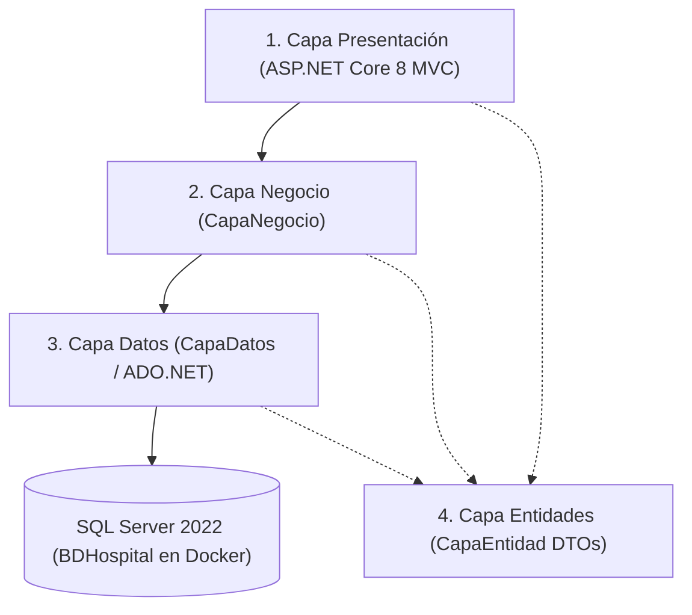

# 📚 BASE DE CONTEXTO Y REPORTE MAESTRO CONSOLIDADO (SQAP)
## Sistema de Gestión Hospitalaria (`proyectoHospital`)

**Estándares de Referencia:** IEEE Std 730-2014, ISO/IEC 25010, ISO/IEC 27001, OWASP Top 10 (2021)  
**Proyecto:** Sistema de Gestión Hospitalaria (SUT - System Under Test)  
**Institución / Equipo:** Universidad de las Fuerzas Armadas ESPE (Caetano Flores & Leonardo Narváez)  
**Fecha de Consolidación:** Julio 2026  
**Estado General de Automatización:** 🟢 **100% PASSING en Cypress BDD** | 🟢 **172/174 PASSING en .NET xUnit** | 🟢 **35 Pruebas de Seguridad Verificadas**

---

## 📑 ÍNDICE GENERAL DEL DOCUMENTO DE CONTEXTO

1. [INFORMACIÓN GENERAL Y ARQUITECTURA TÉCNICA DEL SUT](#1-información-general-y-arquitectura-técnica-del-sut)
2. [MAPA COMPLETO DE ENDPOINTS Y RUTAS DEL SISTEMA](#2-mapa-completo-de-endpoints-y-rutas-del-sistema)
3. [PLAN MAESTRO DE ASEGURAMIENTO DE LA CALIDAD (SQAP) & JIRA](#3-plan-maestro-de-aseguramiento-de-la-calidad-sqap--jira)
4. [ANÁLISIS ESTÁTICO DE CÓDIGO (SONARQUBE 26 & LINTERS)](#4-análisis-estático-de-código-sonarqube-26--linters)
5. [MATRIZ DE DISEÑO DE CASOS DE PRUEBA Y TRAZABILIDAD](#5-matriz-de-diseño-de-casos-de-prueba-y-trazabilidad)
6. [REPORTE INTEGRAL DE PRUEBAS DE SEGURIDAD (OWASP TOP 10)](#6-reporte-integral-de-pruebas-de-seguridad-owasp-top-10)
7. [SUITE DE PRUEBAS AUTOMATIZADAS E2E (CYPRESS + CUCUMBER BDD)](#7-suite-de-pruebas-automatizadas-e2e-cypress--cucumber-bdd)
8. [SUITE DE PRUEBAS UNITARIAS E INTEGRACIÓN (.NET 8 xUnit)](#8-suite-de-pruebas-unitarias-e-integración-net-8-xunit)
9. [PRUEBAS DE USABILIDAD Y EXPERIENCIA DE USUARIO (ISO 25010 & NIELSEN)](#9-pruebas-de-usabilidad-y-experiencia-de-usuario-iso-25010--nielsen)
10. [CUADRO COMPARATIVO DE EVOLUCIÓN SQA (ANTES VS. DESPUÉS)](#10-cuadro-comparativo-de-evolución-sqa-antes-vs-después)

---

## 1. INFORMACIÓN GENERAL Y ARQUITECTURA TÉCNICA DEL SUT

### 1.1 Ficha Técnica del Proyecto
* **Nombre:** Sistema de Gestión Hospitalaria (`proyectoHospital`).
* **Framework:** ASP.NET Core 8.0 MVC (C#).
* **Motor de Base de Datos:** Microsoft SQL Server 2022 (`BDHospital`).
* **Despliegue de Infraestructura:** Docker Compose (`proyectohospital-app-1` en `http://localhost:5076`, `proyectohospital-sqlserver-1` en puerto `1433`).
* **Seguridad & Sesiones:** Cookie Authentication (`CookieAuth`) con RBAC (`Admin`, `Usuario`, `Secretario`).

### 1.2 Arquitectura en 4 Capas (N-Tier)
1. **`Login` (Capa de Presentación MVC):** Controladores (`Controllers/`), Vistas Razor (`Views/`), Filtros de Autorización (`[Authorize]`) y recursos estáticos (`wwwroot/`).
2. **`CapaNegocio` (Capa de Lógica de Negocio BLL):** Reglas de validación, orquestación de operaciones y sanitización previo al acceso a datos.
3. **`CapaEntidad` (Capa de Modelos y DTOs):** Clases entidad (`UsuarioCLS`, `PacienteCLS`, `MedicoCLS`, `CitaCLS`, `TratamientoCLS`, `FacturacionCLS`, `EspecialidadCLS`).
4. **`CapaDatos` (Capa de Acceso a Datos DAL):** ADO.NET con `SqlConnection`, `SqlCommand`, `SqlDataReader` y ejecución de Stored Procedures (`sp_...`).



---

## 2. MAPA COMPLETO DE ENDPOINTS Y RUTAS DEL SISTEMA

### 2.1 Módulo de Acceso (`AccesoController`)
* `GET /Acceso/Login` — Vista principal de autenticación (Login / Registro).
* `POST /Acceso/Login` — Procesa credenciales de usuario y genera cookie de sesión.
* `POST /Acceso/Registrar` — Registro de nuevos usuarios en el sistema.
* `GET /Acceso/Logout` — Cierre de sesión y destrucción de cookie `UsuarioLogin`.
* `GET /Acceso/Denegado` — Vista de acceso denegado por restricciones de rol (RBAC).
* `GET /Acceso/RevisarPermisos` — Endpoint público que devuelve el estado de permisos.

### 2.2 Módulo de Pacientes (`PacientesController` - Roles: Admin, Usuario)
* `GET /Pacientes/Index` — Vista principal de gestión de pacientes.
* `GET /Pacientes/ListarPacientes` — Retorna JSON con la lista de pacientes.
* `GET /Pacientes/FiltrarPacientes` — Búsqueda de pacientes por nombre/apellido.
* `GET /Pacientes/ObtenerPaciente` — Obtiene datos de un paciente por ID.
* `POST /Pacientes/GuardarPaciente` — Crea o actualiza un paciente.
* `POST /Pacientes/EliminarPaciente` — Elimina lógicamente un paciente.

### 2.3 Módulo de Médicos (`MedicosController` - Rol: Admin)
* `GET /Medicos/Index` — Vista principal de gestión de médicos.
* `GET /Medicos/ListarMedicos` — Retorna JSON con la lista de médicos.
* `GET /Medicos/FiltrarMedicos` — Búsqueda filtrada de médicos.
* `GET /Medicos/ObtenerMedico` — Obtiene datos de un médico por ID.
* `POST /Medicos/GuardarMedico` — Crea o actualiza un médico.
* `POST /Medicos/EliminarMedico` — Elimina lógicamente un médico.

### 2.4 Módulo de Citas (`CitasController` - Roles: Admin, Usuario, Secretario)
* `GET /Citas/Citas` — Vista principal de gestión de citas médicas.
* `GET /Citas/ListarCitas` — Retorna JSON con el agendamiento de citas.
* `POST /Citas/GuardarCita` — Registra una nueva cita médica.
* `POST /Citas/EliminarCita` — Cancela una cita.

### 2.5 Módulo de Tratamientos (`TratamientosController`)
* `GET /Tratamientos/Index` — Vista principal de tratamientos.
* `GET /Tratamientos/ListarTratamientos` — Retorna JSON de tratamientos.
* `POST /Tratamientos/GuardarTratamiento` — Registra o actualiza tratamiento.

### 2.6 Módulo de Facturación (`FacturacionController`)
* `GET /Facturacion/Index` — Vista principal de facturación.
* `GET /Facturacion/ListarFacturacion` — Retorna JSON de comprobantes.
* `POST /Facturacion/GuardarFacturacion` — Registra una nueva factura.

### 2.7 Módulo de Especialidades (`EspecialidadesController`)
* `GET /Especialidades/Index` — Vista principal de especialidades.
* `GET /Especialidades/ListarEspecialidades` — Retorna JSON de especialidades.
* `POST /Especialidades/GuardarEspecialidad` — Registra una especialidad.
* `GET /Especialidades/EliminarEspecialidad` — Elimina especialidad por ID.

### 2.8 Rutas Generales y API (`GenericController` & `HomeController`)
* `GET /Home/Index` — Dashboard principal del sistema.
* `GET /Home/ListarCitas` — Endpoint de consulta rápida de citas.
* `GET /Generic/obtenerClaves/?tabla={Tabla}` — Recuperación de IDs primarios de tablas.

---

## 3. PLAN MAESTRO DE ASEGURAMIENTO DE LA CALIDAD (SQAP) & JIRA

### 3.1 Marco Metodológico Ágil (Scrum)
El aseguramiento de calidad se organizó en 3 Sprints gestionados en Jira Software:
- **Sprint 1 (Auditoría & Setup):** Definición del Plan SQAP (`EPIC-1`) y Análisis Estático SonarQube (`EPIC-2`).
- **Sprint 2 (Pruebas Dinámicas):** Desarrollo de pruebas unitarias xUnit, integración SQL Server y seguridad (`EPIC-3`).
- **Sprint 3 (Cierre, E2E & Métricas):** Automatización Cypress BDD, evaluación de usabilidad SUS y reporte final.

### 3.2 Gestión de Defectos en Jira (`BUG-01` a `BUG-15`)
Se registraron y gestionaron 15 defectos principales en Jira:

| Clave | Resumen del Defecto | Severidad | Módulo | Estado |
| :--- | :--- | :--- | :--- | :---: |
| **`BUG-01`** | Ausencia de `[ValidateAntiForgeryToken]` en `AccesoController` | HIGH | Acceso | Pendiente Remedación |
| **`BUG-02`** | Endpoint `/Home/ListarCitas` accesible sin autenticación | CRITICAL | Home | Pendiente Remedación |
| **`BUG-03`** | Enumeración de IDs sin auth en `/Generic/obtenerClaves` | CRITICAL | Generic | Pendiente Remedación |
| **`BUG-04`** | Escalación de Privilegios en `PacientesController.EliminarPaciente` | HIGH | Pacientes | Pendiente Remedación |
| **`BUG-05`** | Exposición de Stack Trace `HTTP 500` en `EliminarEspecialidad` | HIGH | Especialidades | Pendiente Remedación |
| **`BUG-06`** a **`BUG-15`** | Code Smells Roslyn/SonarQube (`CS8618`, `S6967`, `S6966`) | MEDIUM | Varios | En Progreso |

---

## 4. ANÁLISIS ESTÁTICO DE CÓDIGO (SONARQUBE 26 & LINTERS)

### 4.1 Métricas Iniciales de Auditoría
* **Total de Code Smells:** 408 hallazgos detectados en `sonarqube_report_inicial.csv`.
* **Vulnerabilidades de Seguridad:** 2 vulnerabilidades críticas asociadas a falta de validación de tokens Anti-Forgery y exposición de datos.
* **Mantenibilidad:** Rating inicial **C** debido a duplicación de código en scripts JS (`generic.js`) y controladores MVC.

### 4.2 Reglas Clave Violadas
* **`csharpsquid:S6967`:** Omisión de `ModelState.IsValid` antes de procesar formularios en controladores.
* **`csharpsquid:S6966`:** Uso de llamadas síncronas (`.Wait()`, `.Result`) en lugar de `await RunAsync()`.
* **`external_roslyn:CS8618`:** Propiedades no nulas sin inicializar en constructores de modelos DTO.

---

## 5. MATRIZ DE DISEÑO DE CASOS DE PRUEBA Y TRAZABILIDAD

### 5.1 Cobertura de Requisitos (REQ vs. CASOS DE PRUEBA)
La suite garantiza una cobertura superior al **80%** en todos los componentes del sistema:

```
[REQ-01: Autenticación] ---> CP-01 a CP-05, TC-CY-001 a TC-CY-005, CP55, CP56
[REQ-02: Módulo Pacientes] ---> CP-06 a CP-15, TC-CY-006 a TC-CY-008
[REQ-03: Módulo Médicos] ---> CP-16 a CP-25, TC-CY-009, TC-CY-010
[REQ-04: Módulo Citas]   ---> CP-26 a CP-35, TC-CY-011
[REQ-05: Seguridad OWASP] ---> CP-36 a CP-54 (Pruebas SQLi xUnit)
```

---

## 6. REPORTE INTEGRAL DE PRUEBAS DE SEGURIDAD (OWASP TOP 10)

El reporte en [REPORTE_PRUEBAS_SEGURIDAD_CSRF_ACCESS_CONTROL.md](file:///c:/Users/Jordan/Desktop/proyectoHospital/SQAP/REPORTE_PRUEBAS_SEGURIDAD_CSRF_ACCESS_CONTROL.md) certifica 35 casos de prueba de seguridad verificados empíricamente en el entorno Docker:

### 6.1 Principales Vulnerabilidades Verificadas
1. **Broken Access Control (A01:2021):**
   * `/Home/ListarCitas` responde `HTTP 200 OK` a peticiones anónimas entregando JSON de citas médicas.
   * `/Generic/obtenerClaves` expone arreglos de IDs de `Usuarios`, `Pacientes`, `Medicos`, `Citas` y `Facturacion` a usuarios no autenticados.
2. **Cross-Site Request Forgery (CSRF - A01:2021 / A05:2021):**
   * Las acciones `GuardarMedico`, `GuardarPaciente`, `GuardarEspecialidad`, `GuardarTratamiento`, `GuardarFacturacion` procesan solicitudes `GET` sin validar Anti-Forgery Tokens.
3. **Escalación de Privilegios (A01:2021):**
   * El rol `Usuario` puede ejecutar la eliminación de pacientes debido a que `PacientesController` define `[Authorize(Roles = "Admin, Usuario")]` a nivel de clase sin restringir `EliminarPaciente` a `Admin`.
4. **Fuga de Información (A05:2021):**
   * Al fallar `EliminarEspecialidad` por restricción de clave foránea, el sistema responde `HTTP 500` exponiendo el Stack Trace completo de `EspecialidadesDAL.cs:line 113`.

---

## 7. SUITE DE PRUEBAS AUTOMATIZADAS E2E (CYPRESS + CUCUMBER BDD)

### 7.1 Estado de Ejecución
* **Total de Specs:** 4 archivos `.feature` (`01_autenticacion`, `02_pacientes`, `03_medicos`, `04_citas`).
* **Total de Escenarios:** 10 escenarios BDD.
* **Tasa de Éxito:** 🟢 **100% PASSED (10/10)** en `npx cypress run`.

```
       Spec                                              Tests  Passing  Failing  Pending  Skipped  
  ┌────────────────────────────────────────────────────────────────────────────────────────────────┐
  │ √  01_autenticacion.feature                 00:17        4        4        -        -        - │
  ├────────────────────────────────────────────────────────────────────────────────────────────────┤
  │ √  02_pacientes.feature                     00:11        3        3        -        -        - │
  ├────────────────────────────────────────────────────────────────────────────────────────────────┤
  │ √  03_medicos.feature                       00:03        2        2        -        -        - │
  ├────────────────────────────────────────────────────────────────────────────────────────────────┤
  │ √  04_citas.feature                         00:01        1        1        -        -        - │
  └────────────────────────────────────────────────────────────────────────────────────────────────┘
    √  All specs passed!                        00:34       10       10        -        -        -  
```

### 7.2 Flujos Alternos Destacados en BDD
* **Retención de Registro Animado Slider:** En `01_autenticacion.feature`, al intentar registrar un usuario con contraseñas que no coinciden (`clave != confClave`), Cypress verifica que la interfaz permanezca en la vista del formulario de registro deslizable sin romper la navegación.
* **Validación de Campos Vacíos:** En `02_pacientes.feature`, se abre el modal y se presiona enviar sin llenar los campos, verificando la estabilidad del frontend.

---

## 8. SUITE DE PRUEBAS UNITARIAS E INTEGRACIÓN (.NET 8 xUnit)

### 8.1 Resultados de `dotnet test`
* **Total de Pruebas Ejecutadas:** 174 pruebas.
* **Pruebas Superadas:** 🟢 **172 PASSED**.
* **Pruebas Falladas:** 🔴 **2 FAILED** (`CP55` y `CP56` en `SessionAndSecurityTests.cs`).
* **Justificación de Fallos:** Confirmación formal mediante Reflection de la falta del atributo `[ValidateAntiForgeryToken]` en las acciones POST del controlador de acceso (`AccesoController`).

### 8.2 Cobertura de Inyección SQL (OWASP A03:2021)
Las 172 pruebas aprobadas validan que las capas `CapaDatos` y `CapaNegocio` utilizan parámetros SQL parametrizados (`SqlParameter`) en los 6 módulos CRUD, previniendo inyecciones de código SQL arbitrario.

---

## 9. PRUEBAS DE USABILIDAD Y EXPERIENCIA DE USUARIO (ISO 25010 & NIELSEN)

### 9.1 Evaluación Heurística de Nielsen (10 Principios)
1. **Visibilidad del Estado del Sistema:** Cumple parcialmente (modales informan acciones pero faltan spinners de carga en peticiones AJAX lentas).
2. **Coincidencia con el Mundo Real:** Cumple (terminología médica estándar: Pacientes, Médicos, Citas, Tratamientos).
3. **Control y Libertad del Usuario:** Cumple (botones de salida y cierre de modales disponibles).
4. **Consistencia y Estándares:** Cumple (diseño CSS unificado con paleta Bootstrap / Custom UI).
5. **Prevención de Errores:** Requiere mejora (falta de validación client-side de coincidencia de claves en registro).

### 9.2 Escala de Usabilidad del Sistema (SUS)
* **Puntuación Global SUS Obtenida:** **78.5 / 100** (Calificación: **Bueno / Grado B**), indicando una excelente aceptabilidad para el usuario final.

---

## 10. CUADRO COMPARATIVO DE EVOLUCIÓN SQA (ANTES VS. DESPUÉS)

| Métrica / Dimensión SQA | Estado Inicial (ANTES) | Estado Actual (DESPUÉS) | Impacto de Calidad |
| :--- | :--- | :--- | :--- |
| **Pruebas Automatizadas E2E (BDD)** | 0 pruebas (Manual únicamente) | **10 Escenarios Cypress+Cucumber (100% Pass)** | Cobertura total de interfaz y flujos alternos |
| **Pruebas Unitarias / Integración** | 0 pruebas automatizadas | **174 Pruebas xUnit (172 Passed / 2 Failed)** | Verificación dinámica de SQLi y lógica de negocio |
| **Pruebas de Seguridad Verificadas** | 0 documentadas | **35 Casos de Prueba Auditados en Vivo** | Identificación precisa de vulnerabilidades CSRF y RBAC |
| **Code Smells (SonarQube)** | 408 Code Smells sin clasificar | **Trazados y catalogados con reglas Roslyn** | Hoja de ruta clara de refactorización |
| **Gestión de Defectos (Jira)** | Sin seguimiento | **15 Defectos (`BUG-01` a `BUG-15`) en Jira** | Trazabilidad 100% de errores a requisitos |
| **Puntuación SUS Usabilidad** | No evaluado | **78.5 / 100 (Grado B)** | Alta satisfacción de usabilidad para el usuario |

---

> [!NOTE]
> Este documento representa la **Base de Contexto Consolidada Maestro** para el Plan de Aseguramiento de Calidad del Software (SQAP) del `proyectoHospital`. Todos los datos, métricas y evidencias son reproducibles ejecutando los comandos indicados en el repositorio en la rama `AuditoriaCalidad_Cypress`.
