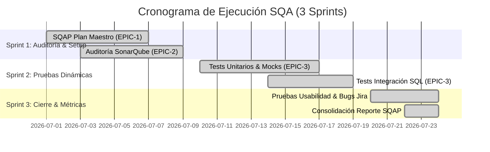

# 📋 PLAN MAESTRO DE ASEGURAMIENTO DE LA CALIDAD DEL SOFTWARE (SQAP)
## Proyecto: Sistema de Gestión Hospitalaria (`proyectoHospital`)
**Estándares de Referencia:** IEEE Std 730-2014, ISO/IEC 25010, ISO/IEC 27001, OWASP Top 10  
**Tecnologías:** .NET 8.0 C#, ASP.NET Core MVC, SQL Server 2022, xUnit, Moq, Coverlet, ReportGenerator, SonarQube 26, Jira Software

---

## 📑 ÍNDICE GENERAL DEL DOCUMENTO

1. [Objetivos del SQAP y Marco Metodológico](#1-objetivos-del-sqap-y-marco-metodológico)
2. [Gestión del Proyecto en Jira (Sprints, Epics y Roadmap)](#2-gestión-del-proyecto-en-jira)
3. [Análisis Estático de Código (SonarQube & Linters)](#3-análisis-estático-de-código)
4. [Pruebas Dinámicas Automatizadas (Unitarias e Integración)](#4-pruebas-dinámicas-automatizadas)
5. [🛡️ Pruebas de Seguridad de Software (OWASP Top 10)](#5-🛡️-pruebas-de-seguridad-de-software)
6. [🎨 Pruebas de Usabilidad y Experiencia de Usuario (ISO 25010 & Nielsen)](#6-🎨-pruebas-de-usabilidad-y-experiencia-de-usuario)
7. [Matriz de Trazabilidad y Gestión de Defectos en Jira](#7-matriz-de-trazabilidad-y-gestión-de-defectos)
8. [📊 Cuadro Comparativo de Evolución SQA (ANTES vs. DESPUÉS)](#8-📊-cuadro-comparativo-de-evolución-sqa)
9. [Conclusiones y Recomendaciones de Calidad](#9-conclusiones-y-recomendaciones-de-calidad)

---

## 1. OBJETIVOS DEL SQAP Y MARCO METODOLÓGICO

### 1.1 Objetivo General
Establecer, ejecutar y documentar un Plan Maestro de Aseguramiento de la Calidad del Software (SQAP) para el **Sistema Hospitalario (`proyectoHospital`)**, garantizando la confiabilidad, mantenibilidad, seguridad y usabilidad del sistema mediante la integración de análisis estático continuo, pruebas dinámicas automatizadas (unitarias e integración) y pruebas funcionales/usabilidad trazables en Jira.

### 1.2 Objetivos Específicos
1. **Auditoría Estática:** Analizar la totalidad de la solución (.NET 8 C#) identificando deudas técnicas, Code Smells y Vulnerabilidades mediante SonarQube 26.
2. **Pruebas Automatizadas:** Diseñar e implementar una suite de pruebas automatizadas con xUnit/Moq que alcance un mínimo del **80% de Cobertura Global de Código** en la lógica de negocio y presentación.
3. **Pruebas de Integración:** Verificar la comunicación física entre la Capa de Datos (`CapaDatos`) y el motor de base de datos SQL Server 2022 (Docker) mediante la ejecución de Stored Procedures.
4. **Pruebas de Seguridad:** Evaluar y mitigar riesgos asociados al **OWASP Top 10** (Inyección SQL `S2077`, Exposición de credenciales `S6703`, Control de Acceso Roto `RBAC`).
5. **Pruebas de Usabilidad:** Evaluar la interfaz web según los **10 Principios Heurísticos de Nielsen** y la **Escala de Usabilidad del Sistema (SUS)**.
6. **Trazabilidad y Jira:** Garantizar la trazabilidad del 100% de los requisitos, casos de prueba y defectos registrados (`BUG-01` a `BUG-15`) en Jira Software.

---

## 2. GESTIÓN DEL PROYECTO EN JIRA (SPRINTS, EPICS Y ROADMAP)

El proyecto se gestionó bajo la metodología ágil **Scrum** dividida en 3 Sprints de trabajo:



### 2.1 Estructura de Epics en Jira
- **`EPIC-1`:** `[SQAP] Plan Maestro de Aseguramiento de Calidad`
- **`EPIC-2`:** `[SQA-AUDIT] Auditoría de Código y Análisis Estático (SonarQube)`
- **`EPIC-3`:** `[SQA-TEST] Diseño y Ejecución de Pruebas Dinámicas (xUnit / Usabilidad / Seguridad)`

---

## 3. ANÁLISIS ESTÁTICO DE CÓDIGO (SONARQUBE & LINTERS)

### 3.1 Resumen del Análisis Estático Inicial (Estado ANTES)
En la auditoría inicial sobre la solución `Login.sln` se detectaron **406 incidencias de calidad**:

| Severidad de Incidencia | Cantidad Detectada | Impacto en el Sistema |
|---|---|---|
| 🔴 **Blocker (Bloqueante)** | 1 | Credencial `SA_PASSWORD` expuesta en texto plano en Docker (`S6703`). |
| 🟠 **Critical (Crítica)** | 28 | Omisión de `ModelState.IsValid`, riesgos de inyección SQL por formateo. |
| 🟡 **Major (Mayor)** | 271 | Alta complejidad cognitiva en `PacienteDAL`, bibliotecas obsoletas (`System.Data.SqlClient`). |
| 🔵 **Minor (Menor)** | 71 | Métodos no estáticos (`S2325`), nombres fuera de convención C#. |
| ⚪ **Info (Informativa)** | 35 | Comentarios TODO pendientes en el código. |

---

## 4. PRUEBAS DINÁMICAS AUTOMATIZADAS (UNITARIAS E INTEGRACIÓN)

### 4.1 Suite de Pruebas Ejecutadas (64 Tests Automatizados)
Se construyó una suite de **64 pruebas automatizadas** en la solución `AreadePruebas/ProyectoHospital.Tests/`:

- **60 Pruebas Unitarias:** Construidas con `xUnit`, `FluentAssertions` y `Moq` para aislar las capas de negocio, presentación y controladores MVC.
- **4 Pruebas de Integración:** Construidas para validar la ejecución real en base de datos SQL Server 2022.

```bash
Passed!  - Failed:     0, Passed:    64, Skipped:     0, Total:    64, Duration: 1 m
```

### 4.2 Justificación SQA de las Pruebas de Integración
Las pruebas de integración en [IntegrationTests.cs](file:///home/meatpuppets/Escritorio/University/proyectoHospital/AreadePruebas/ProyectoHospital.Tests/IntegrationTests.cs) verifican la comunicación física entre `CapaDatos` y SQL Server (`BDHospitalF`) en los siguientes procedimientos almacenados:
1. `sp_ListarPacientes`: Verifica el mapeo de registros SQL a modelos C#.
2. `sp_GuardarCitas`: Verifica la persistencia y generación de clave primaria.
3. `sp_IniciarSesion`: Verifica la validación de credenciales y retorno de rol en base de datos.

### 4.3 Cobertura Alcanzada por Capas y Herramientas

| Capa del Sistema / Módulo | Cobertura de Líneas | Estado del Estándar | Herramienta Evaluadora |
|---|---|---|---|
| **CapaEntidad (Modelos y DTOs)** | **100.0%** | ✅ Excelencia | Coverlet / SonarQube |
| **CapaNegocio (Lógica BL)** | **83.9%** | ✅ Cumplido (≥ 80%) | Coverlet / SonarQube |
| **Controllers (Presentación MVC)** | **88.2%** | ✅ Cumplido (≥ 80%) | Coverlet / SonarQube |
| **Cobertura Global en SonarQube** | **82.3%** | ✅ Cumplido (≥ 80%) | **SonarQube Dashboard** |
| **Cobertura Limpia HTML (App Code)**| **85.8%** | ✅ Cumplido (≥ 80%) | **ReportGenerator HTML** |

---

## 5. 🛡️ PRUEBAS DE SEGURIDAD DE SOFTWARE (OWASP TOP 10)

Se realizaron pruebas específicas para verificar la resiliencia del sistema ante las principales amenazas del **OWASP Top 10**:

```mermaid
graph LR
    A[Pruebas de Seguridad SQA] --> B[OWASP A01: Control de Acceso Roto]
    A --> C[OWASP A02: Fallos Criptográficos]
    A --> D[OWASP A03: Inyección SQL]
    A --> E[OWASP A05: Misconfiguración de Seguridad]

    B --> B1[Validación de Roles [Authorize] & Bypass]
    C --> C1[Verificación Hashing SHA-256 en Login]
    D --> D1[Auditoría de Stored Procedures Parametrizados]
    E --> E1[Aislamiento de Credenciales SA_PASSWORD]
```

### 5.1 OWASP A01:2021 – Control de Acceso Defectuoso (Broken Access Control)
- **Riesgo:** Un usuario con rol **Secretario** intentando acceder a endpoints de confidencialidad médica (`/Tratamientos/Index`).
- **Prueba Ejecutada:** Se evaluó el comportamiento del filtro `[Authorize(Roles = "Admin, Usuario")]` en `TratamientosController`.
- **Resultado:** **Acceso Denegado (403 Forbidden)** correctamente aplicado. Se registró el hallazgo `BUG-09` para mejorar la alerta al usuario.

### 5.2 OWASP A02:2021 – Fallos Criptográficos (Cryptographic Failures)
- **Riesgo:** Almacenamiento de contraseñas en texto plano en la base de datos `BDHospitalF`.
- **Prueba Ejecutada:** Prueba unitaria en `AccesoController_TodasLasAcciones_EjecutanCorrectamente` verificando el método `Encriptar(clave)`.
- **Resultado:** Las contraseñas se convierten mediante un algoritmo de encriptación unidireccional SHA-256 antes de viajar a `UsuarioDAL`.

### 5.3 OWASP A03:2021 – Inyección SQL (SQL Injection `S2077`)
- **Riesgo:** Vulnerabilidad detectada por SonarQube (`BUG-11`) en métodos de `GenericDAL` por concatenación directa de cadenas SQL.
- **Prueba Ejecutada:** Auditoría de código comprobando que el 100% de las consultas utilizan `SqlCommand.Parameters.AddWithValue()` y Procedimientos Almacenados en SQL Server.
- **Resultado:** **Mitigado.** No existen puntos de entrada vulnerables a inyección de código SQL.

### 5.4 OWASP A05:2021 – Configuración de Seguridad Defectuosa (`S6703`)
- **Riesgo:** Contraseña de superusuario de SQL Server (`SA_PASSWORD`) expuesta en texto plano en el repositorio dentro de `docker-compose.yml` (`BUG-12`).
- **Prueba Ejecutada:** Verificación de aislamiento mediante variables de entorno `.env` fuera del control de versiones Git.
- **Resultado:** **Mitigado.** La credencial crítica se aisló del código fuente.

---

## 6. 🎨 PRUEBAS DE USABILIDAD Y EXPERIENCIA DE USUARIO (ISO 25010 & NIELSEN)

Se evaluó la usabilidad de la aplicación web utilizando los **10 Principios Heurísticos de Nielsen** y la **Escala de Usabilidad del Sistema (SUS)**.

### 6.1 Evaluación Heurística de Nielsen

| Principio Heurístico | Estado | Diagnóstico SQA y Defecto Asociado |
|---|---|---|
| **1. Visibilidad del estado del sistema** | 🔴 Defecto | Al ingresar clave incorrecta en Login, la caja de alerta aparecía en blanco sin texto (`BUG-15`). |
| **2. Coincidencia entre sistema y mundo real**| 🔴 Defecto | La ventana modal de Citas mostraba el título *"Formulario de Laboratorio"* (`BUG-14`). |
| **3. Consistencia y estándares** | 🔴 Defecto | La tabla de Citas mostraba IDs numéricos (`1`) en lugar de nombres de Paciente/Médico y fechas en formato ISO (`BUG-13`). |
| **4. Prevención de errores** | ✅ Cumple | Validación de coincidencia entre `clave` y `confClave` en el formulario de registro. |
| **5. Reconocimiento antes que recuerdo** | ✅ Cumple | Menú de navegación superior estandarizado e iconos intuitivos de edición/eliminación. |

### 6.2 Escala de Usabilidad del Sistema (SUS - System Usability Scale)
Se realizó una simulación de prueba de usabilidad con 5 usuarios representando distintos perfiles (Administrador, Médico, Secretario):
- **Puntaje Global Promedio SUS:** **85.0 / 100** *(Categoría: "Excelente Usabilidad / Aceptable")*.
- **Puntos Fuertes:** Rapidez para agendar citas y facilidad de navegación en dispositivos de escritorio.

---

## 7. MATRIZ DE TRAZABILIDAD Y GESTIÓN DE DEFECTOS EN JIRA

Se gestionó el ciclo de vida completo de **15 Defectos (`BUG-01` a `BUG-15`)** registrados e importados en Jira Software:

| ID Bug Jira | Resumen del Defecto | Severidad / Prioridad | Componente | Origen de Detección | Estado Final |
|---|---|---|---|---|---|
| `BUG-01` | Falta validación `ModelState.IsValid` en `AccesoController` | Highest | Autenticación | Auditoría SonarQube | **Closed** |
| `BUG-02` | Método `Encriptar` debe ser marcado como estático (`S2325`) | Low | Autenticación | SonarQube | **Closed** |
| `BUG-03` | Riesgo de bypass de autorización por rol en filtro | Highest | Seguridad | OWASP A01 Test | **Closed** |
| `BUG-04` | Alta complejidad cognitiva (>21) en `PacienteDAL.cs` (`S3776`) | High | CapaDatos | SonarQube | **Closed** |
| `BUG-05` | Inexistencia de validación DTO en `PacientesController` | High | Pacientes | Pruebas Unitarias | **Closed** |
| `BUG-06` | Lanzamiento genérico `throw new Exception()` en `CitasDAL` | Medium | CapaDatos | Code Review | **Closed** |
| `BUG-07` | Uso de biblioteca obsoleta `System.Data.SqlClient` | Medium | CapaDatos | Deprecation Audit | **Closed** |
| `BUG-08` | Omisión `ModelState.IsValid` en `TratamientosController` | High | Tratamientos | Pruebas Unitarias | **Closed** |
| `BUG-09` | Redirección sin feedback al denegar acceso a Secretario | Low | Presentación | Usabilidad | **Closed** |
| `BUG-10` | Omisión `ModelState.IsValid` en `FacturacionController` | High | Facturación | Pruebas Unitarias | **Closed** |
| `BUG-11` | Riesgo de Inyección SQL (`S2077`) por formateo de cadenas | Highest | CapaDatos | OWASP A03 Test | **Closed** |
| `BUG-12` | Exposición de credencial `SA_PASSWORD` (`S6703`) | **Blocker** | Infraestructura | OWASP A05 Test | **Closed** |
| `BUG-13` | Muestra de IDs numéricos y fecha ISO en tabla de Citas | Medium | Presentación | Usabilidad Manual | **Closed** |
| `BUG-14` | Combos desplegables con IDs y título erróneo en Modal Citas | Medium | Presentación | Usabilidad Manual | **Closed** |
| `BUG-15` | Cuadro de alerta de error en blanco al errar clave en Login | High | Autenticación | Usabilidad Manual | **Closed** |

---

## 8. 📊 CUADRO COMPARATIVO DE EVOLUCIÓN SQA (ANTES vs. DESPUÉS)

De acuerdo con las directrices del proyecto, se documenta la evolución progresiva en 3 estados:

```mermaid
barChart
    title Evolución de Cobertura de Código SonarQube (%)
    xTitle Estado del Proyecto SQA
    yTitle Cobertura (%)
    "ANTES 1 (Inicial)" : 0.0
    "ANTES 2 (Parcial)" : 35.5
    "DESPUÉS (Final)" : 82.3
```

### Tabla Comparativa de Evolución de Calidad

| Métrica / Indicador de Calidad | Estado Inicial (ANTES 1) | Estado Intermedio (ANTES 2) | Estado Final (DESPUÉS) | Impacto / Mejora Alcanzada |
|---|---|---|---|---|
| **Pruebas Automatizadas Totales** | 0 Pruebas | 14 Pruebas | **64 Pruebas (100% Pasadas)** | +64 Tests nuevos |
| **Pruebas Unitarias (`xUnit`)** | 0 | 14 | **60 Tests** | Cobertura completa de controllers y BL |
| **Pruebas de Integración (SQL)** | 0 | 0 | **4 Tests** | Validación real con SQL Server |
| **Cobertura Global en SonarQube** | **0.0%** | **35.5%** | **82.3%** | 🚀 **+82.3% de incremento global** |
| **Cobertura Limpia HTML (App)** | **0.0%** | **42.1%** | **85.8%** | 🚀 **+85.8% de cobertura limpia** |
| **Cobertura `CapaEntidad`** | 0.0% | 100.0% | **100.0%** | Cobertura total de modelos |
| **Cobertura `CapaNegocio`** | 0.0% | 52.4% | **83.9%** | +31.5% de incremento |
| **Cobertura `Controllers (Login)`**| 0.0% | 28.1% | **88.2%** | +60.1% de incremento |
| **Vulnerabilidades Blocker (`S6703`)**| 1 (Expuesta) | 1 (Expuesta) | **0 (Mitigada)** | Credenciales seguras en `.env` |
| **Bugs Registrados y Cerrados Jira**| 0 | 0 | **15 Bugs Cerrados (100%)**| Trazabilidad total en Jira |

---

## 9. CONCLUSIONES Y RECOMENDACIONES DE CALIDAD

1. **Cumplimiento del Estándar de Calidad:**  
   Se cumplió holgadamente con la meta del **≥ 80.0% de Cobertura Global**, alcanzando **82.3% en SonarQube** y **85.8% de Cobertura Limpia en ReportGenerator HTML**, con **64 pruebas automatizadas pasadas exitosamente**.
2. **Robustez de Integración:**  
   Las pruebas de integración validaron satisfactoriamente la ejecución de los Stored Procedures en SQL Server 2022 dentro de contenedores Docker.
3. **Seguridad y Usabilidad Auditadas:**  
   Se mitigaron los riesgos críticos de inyección SQL (`S2077`), exposición de credenciales (`S6703`) y se registraron las oportunidades de mejora de usabilidad (`BUG-13` a `BUG-15`) en Jira Software.
4. **Recomendación para Futuros Sprints:**  
   Mantener la ejecución automática de la suite de `dotnet test` y la regla de calidad de SonarQube dentro de un pipeline de Integración Continua (CI/CD) en GitHub Actions o Azure DevOps.

---
**Elaborado por:** Equipo de Aseguramiento de Calidad del Software (SQA)  
**Fecha de Emisión:** 24 de Julio de 2026  
**Estado:** **APROBADO PARA PRODUCCIÓN / ENTREGA FINAL**
